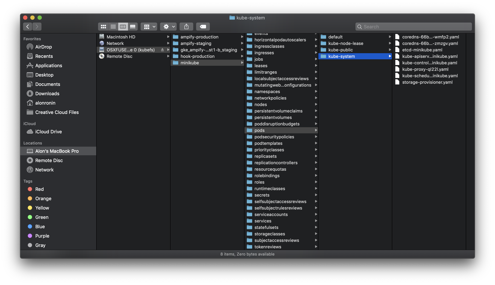
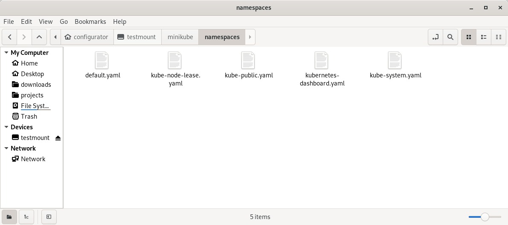
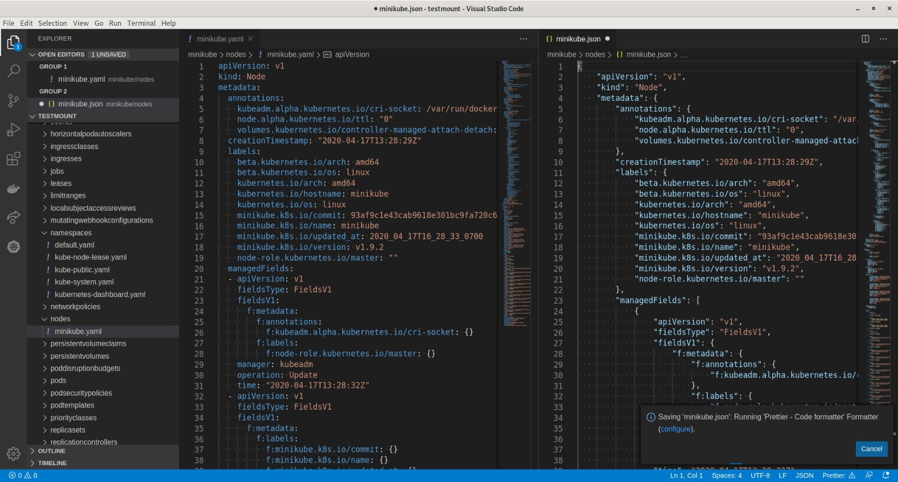
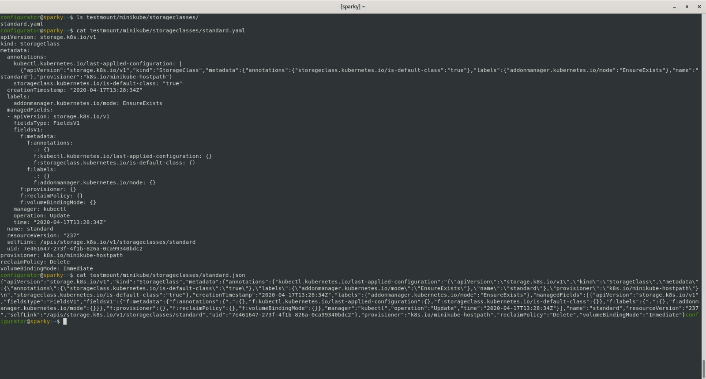

# kubefs


Mount kubernetes's metadata object store as a file system



# Downloading

There are several options for downloading kubefs:

- Download the [latest release from GitHub](https://github.com/configurator/kubefs/releases/latest)

- Build it directly from source using `go get`:

  ```shell
  go get github.com/configurator/kubefs
  ```

  Note: this is often broken because it not only gets the `master` branch of this repository - but
  also all the dependencies.

- Build it directly from source by cloning this repository and running

  ```shell
  go build .
  ```

  to create a `kubefs` binary

- Run it directly from source by cloning tihs repository and using

  ```shell
  go run . [<options>] <dir>
  ```

  instead of a `kubefs` binary.

# Dependencies

For MacOS you will need [osxfuse](https://github.com/osxfuse/osxfuse/releases):

or you can install with brew formula:

```shell
$ brew install osxfuse
```

For Windows you will need [WinFSP](http://www.secfs.net/winfsp/).

# Usage

```shell
kubefs [<options>] <dir>
```
Mounts the default kubernetes cluster onto dir.

#### Options

- `-c`, `--kubeconfig`:

  Like in `kubectl`, you can use the `--kubeconfig` flag to specify an alternate
  `kube.config` file, or pass the `KUBECONFIG` environment flag. All contexts in the passed config
  file will be available.

- `--show-json-files`:

  Show json files in directory listings. By default, they are there but hidden.

- `--show-yaml-files=false`:

  Hide yaml files in directory listings. If you don't combine this with `--show-json-files`,
  directories will all be empty. Files are still readable, just not listed in directory listings.

- `--pretty-json`:

  When opening `.json` files, pretty-print them with newlines and indentation..

# Files

Files in the mounted directory will have the following directory structure:

- `/<context>`
    - all contexts available from `kubeconfig` should appear here, allowing you to browse multiple
      clusters without switching with `kube config use-context`.
- `/<context>/<object-type>`
- `/<context>/<object-type>/<name>.yaml`
    - for global objects that have no namespace, such as `nodes`,`clusterroles` or `namespaces`
      themselves
- `/<context>/<object-type>/<namespace>`
- `/<context>/<object-type>/<namespace>/<name>.yaml`
    - for namespaced objects such as `pods`, `deployments`, etc.

All object files end in `.yaml`. However, the file system has a secret - the extension can be
changed to see the objects in different formats. Currently supported formats are:

- `.yaml`
- `.json`

These extra formats will not show up in directory listings, but are available to any application
that tries to read them. Omitting the extension also works and returns the default format, yaml.

# Ideas for exploring

- Use `find <dir>` to see an entire listing of all kubernetes objects.

- Open the directory in an IDE to look around

- Snapshot the entire kubernetes object store by copying directory contents - though restoring isn't
  currently possible, you'd have a backup of each individual object.

# Some more screenshots







# Roadmap

- [x] List / get all kubernetes objects as files
- [x] Linux support
- [x] Mac support
- [x] Windows support
- [x] Delete objects
- [x] Edit existing objects
- [x] Create new objects
- [ ] Support file system watchers, so IDEs know to reload the file after saving
- [ ] Connect the file system watchers to kubernetes watchers so files can be reloaded when changed
      on the server
- [ ] When writing files fails, add a comment to the top explaining the failure
- [ ] When reading a missing file, allow the read with some dummy data as a result,
      which will help create new files in IDEs
